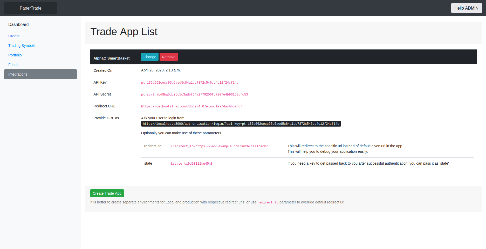
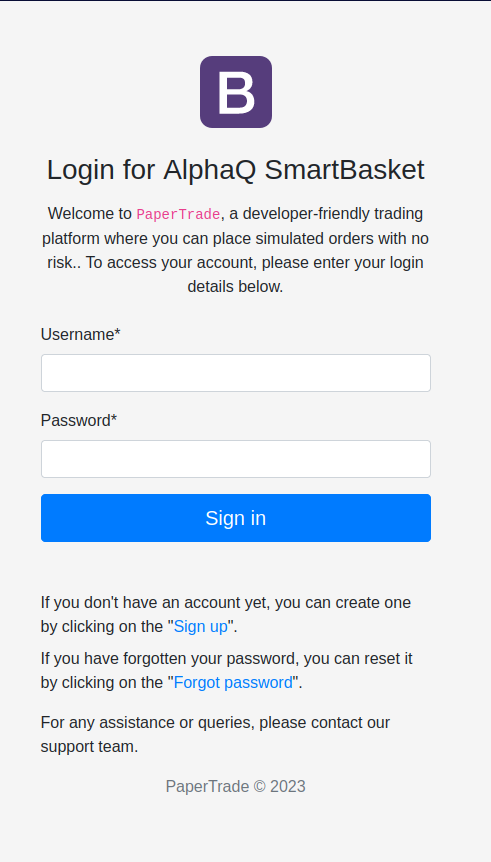
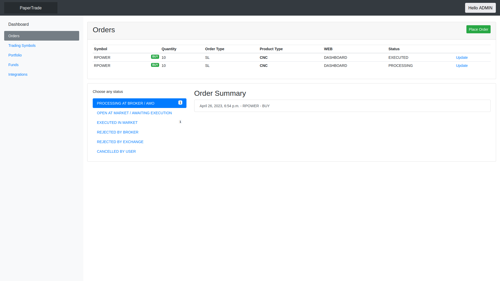

# Paper Trade - Broker Backend for Developers
Paper Trade is an open-source Django project with APIs designed to serve as a broker backend for developers working with Indian stock market-related applications. It allows developers to create customer and vendor accounts, facilitate order placement, check order status, manage funds, portfolios, and more. The project serves as a development toolkit for traders, offering a sample broker environment for testing and development purposes.

## Project Structure
The Paper Trade project consists of the following apps:

- **apps.users**: Handles user-related functionalities.
- **apps.utilities**: Provides common utility functions.
- **apps.broking**: Acts as a container for broking-based apps.
- **apps.broking.authentication**: Handles user authentication and customer authentication for the vendor app.
- **apps.broking.funds**: Manages user funds.
- **apps.broking.orders**: Handles user orders.
- **apps.broking.stock_exchange**: Acts as a stock exchange.

## Features
- **Customer Accounts:** Users can create customer accounts to access the platform.
- **Vendor Accounts:** Developers (vendors) can create vendor accounts to provide additional functionalities and privileges to users.
- **Authentication:** Vendors can obtain an access key and access secret to generate an access token for customer accounts.
- **User Funds Management:** Users can recharge their accounts to manage funds. Funds are deducted accordingly upon order placement.
- **Order Placement:** Users can place orders with various parameters such as symbol, exchange type, order type, product type, transaction type, validity, quantity, limit price, trigger price, stop loss price, and more.
- **Order Status:** Users can check the status of their orders, which can be in the following states: PROCESSING, OPEN, EXECUTED, REJECTED_BY_BROKER, REJECTED_BY_EXCHANGE, or CANCELLED.
- **Portfolios (TODO):** (Please provide additional information on how portfolios are managed in your project)
- **Stock Exchange Integration:** The project includes functionality related to the stock exchange, allowing users to interact with the market.


## Authentication Process
To authenticate users and vendors, the project follows the following process:

1. Vendors create a TradeApp at the dashboard and receive an access key and access secret.
2. Vendors redirect users to the Paper Trade login page, appending the access key as a query parameter. 
For example: `https://papertrade.example.com/authentication/login/?api_key=xxxxxxxxxxxxxxxxxxxxxx`
3. Users log in with their credentials on the login page.
4. Upon successful authentication, the page redirects users to a predefined redirect URL or the default URL 
`http://localhost:8000/callback/` with query parameters userid=yyy&access_token=zzzzzzzzzz.
eg: `http://localhost:8000/callback/?userid=yyy&access_token=zzzzzzzzzz`


## Dashboard Screenshots
To get a glimpse of the Paper Trade project's user interface, here are some screenshots of the dashboard screens. 
These screenshots showcase the various features and functionalities of the application. Please refer to the 
screenshots directory for more detailed images.








## Installation and Setup
To run the Paper Trade project locally, follow these steps:

1. Clone the repository:
``` sh
git clone https://github.com/your_username/paper-trade.git 
``` 


2. Navigate to the project directory:
``` sh
cd paper-trade
```

3. Create a virtual environment and activate it: 
``` sh
python3 -m venv env
source env/bin/activate
```

4. Install the project dependencies:
```sh
pip install -r requirements.txt 
```

5. Apply database migrations:
``` sh
python manage.py migrate 
```

6. Start the development server:
``` sh
python manage.py runserver
```

Access the application in your browser at http://localhost:8000.

##  Usage and API Endpoints
(TODO: Provide information on how to use the Paper Trade project and its API endpoints.)
The Paper Trade project provides the following API endpoints:

#### Account Management APIs
- Endpoint 1: `/api/profile/`
  -- Description: Retrieves the user's account profile.
  -- Method: `GET`

- Endpoint 2: `/api/funds/`
  -- Description: Allows users to recharge their account or view transaction history.
  -- Method: `GET `(retrieve transaction history) or `POST` (recharge account)

- Endpoint 3: `/api/portfolio/`
  -- Description: Displays the user's current holdings in their demat account.
  -- Method: `GET`

#### Orders Management APIs
- Endpoint 4: `/api/orders/`
  -- Description: Lists all the orders the user has placed.
  -- Method: `GET` (retrieve all orders) or `POST` (place a new order)

- Endpoint 5: `/api/orders/{order_id}/`
  -- Description: Retrieves detailed information about a specific order.
  -- Method: `GET`

- Endpoint 6: `/api/orders/{order_id}/cancel/`
  -- Description: Cancels a specific order.
  -- Method: `POST`
  
For more detailed information on each endpoint, including request/response formats and required parameters, refer to the
API documentation provided in the [API.md](./docs/API.md) file.

## Request for Contributions
We welcome contributions from the community to enhance and improve the Paper Trade project. If you're interested in contributing, 
please follow the guidelines below:

1. Fork the repository and clone it to your local machine.
2. Create a new branch for your feature or bug fix.
3. Implement the necessary changes and ensure that the project builds successfully.
4. Write tests to cover your changes (if applicable).
5. Submit a pull request, describing the changes you've made and providing any relevant information.
6. Our team will review your contribution and work with you to merge it into the main project if it aligns with our goals.

## Buy Me a Coffee
If you find this project helpful and would like to show your support, you can buy us a coffee. Your contributions help us maintain 
and improve the project. You can find the link to buy us a coffee in the project's documentation.

## Commercial Support
We offer commercial support for the Paper Trade project. If you require additional assistance, customizations, or consulting services, 
please reach out to our team at jerinisready@gmail.com . 
We'd be happy to discuss how we can assist you with your specific needs.


## Python 3.10  Support
The Paper Trade project fully supports Python 3.10 and below upto 3.4. It is recommended to use Python 3.8 or a compatible version
to ensure compatibility and take advantage of the latest features and improvements.

If you encounter any issues or have questions regarding Python 3.10 support, please refer to our documentation or open a GitHub issue for
 assistance.


